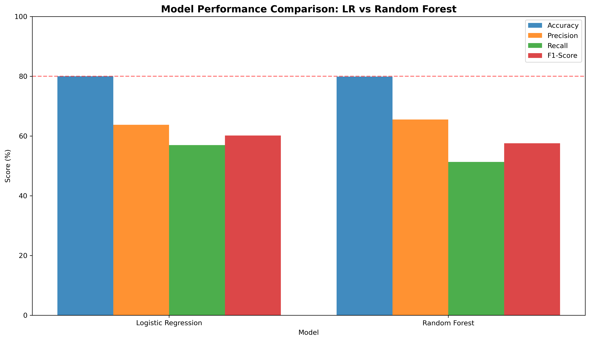
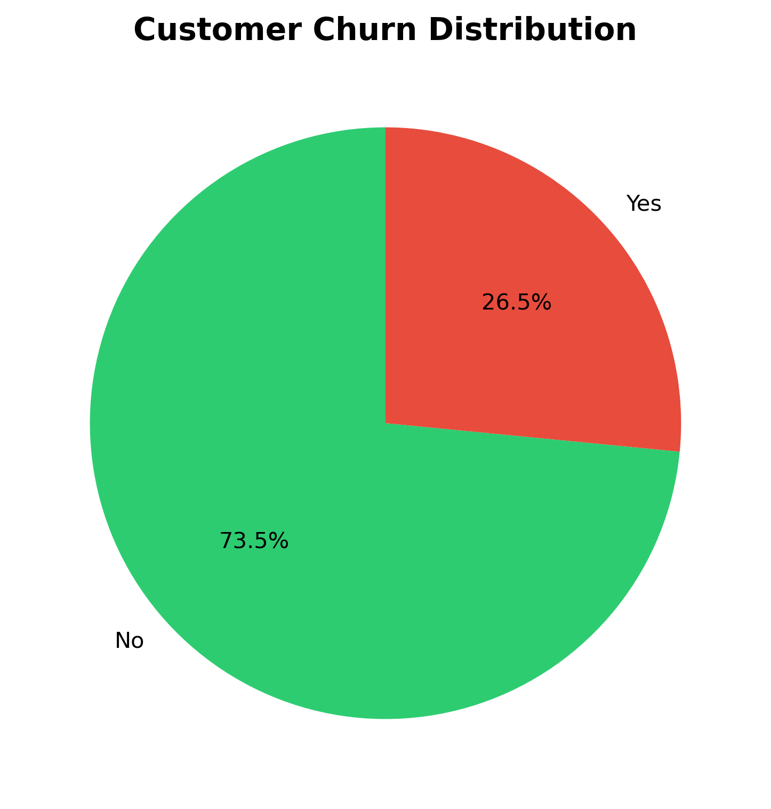
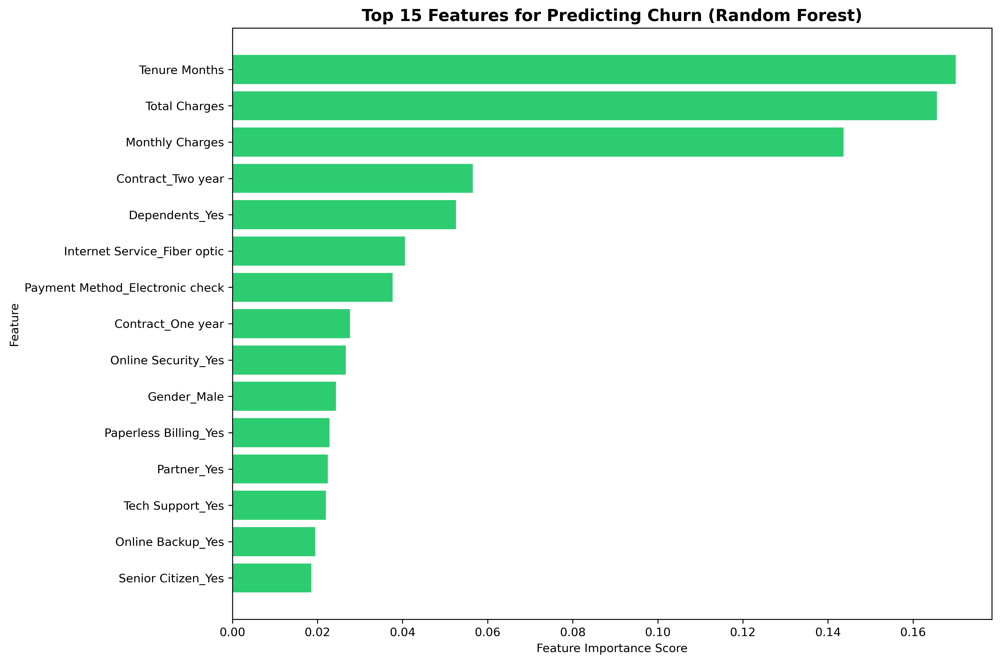

# Customer Churn Prediction Model

Predictive analytics project identifying at-risk telecom customers before they churn, enabling proactive retention campaigns.



## 📊 Project Overview

Built and compared machine learning models to predict customer churn for a telecom company. The best-performing model (Logistic Regression) achieved **79.99% accuracy** and identified **1,064 at-risk customers**, enabling targeted retention campaigns worth **$231,756 in annual net revenue**.

**Key Results:**
- **Accuracy:** 79.99%
- **Recall:** 56.95% (identified 57% of churners)
- **Annual Revenue Impact:** $231,756 net savings
- **ROI:** 436% on retention investment
- **Effectiveness:** 291x better than random outreach

## 📁 Dataset

**Source:** [Kaggle - Telco Customer Churn](https://www.kaggle.com/datasets/abdallahwagih/telco-customer-churn)

- **Customers:** 7,043
- **Features:** 35 (after engineering)
- **Churn Rate:** 26.5%
- **Time Period:** 1 year (2025)

## 🛠️ Technologies Used

- **Python 3.9+**
- **Data Analysis:** pandas, numpy
- **Machine Learning:** scikit-learn
- **Visualization:** matplotlib, seaborn
- **Development:** Jupyter Notebook

## 🔍 Methodology

### 1. Exploratory Data Analysis
- Analyzed churn patterns across contract types, tenure, and pricing
- Created 5 visualizations identifying key predictors
- Discovered month-to-month contracts have 15x higher churn (42.71% vs 2.83%)

### 2. Data Cleaning & Feature Engineering
- Handled missing values in Total Charges (11 records)
- Removed data leakage columns (Churn Reason, Churn Score)
- One-hot encoded 17 categorical variables
- Train/test split: 80/20 with stratification

### 3. Model Development
- **Logistic Regression** (baseline): 79.99% accuracy, 56.95% recall
- **Random Forest** (comparison): 79.91% accuracy, 51.34% recall
- Selected Logistic Regression as final model (better recall)

### 4. Feature Importance Analysis
Top 3 predictors:
1. **Tenure Months** (17.0%) - How long customer has been with company
2. **Total Charges** (16.6%) - Cumulative spending
3. **Monthly Charges** (14.4%) - Current monthly bill

## 📈 Key Findings

### Finding 1: Contract Type is Strongest Predictor
- Month-to-month: **42.71% churn rate**
- One year: **11.27% churn rate**
- Two year: **2.83% churn rate**

**Recommendation:** Incentivize longer contracts with discounts or perks

### Finding 2: Early Tenure = High Churn Risk
- Churned customers: **18 months** average tenure
- Retained customers: **37.6 months** average tenure

**Recommendation:** Implement early engagement program (months 0-24)

### Finding 3: Price-Value Perception Gap
- Churned customers pay: **$74.44/month**
- Retained customers pay: **$61.27/month**

**Recommendation:** Improve perceived value for high-paying customers through premium support and exclusive features

## 💰 Business Impact

**Without Model:**
- Random outreach saves ~28 customers = $25,012 annually

**With Model:**
- Targeted outreach saves ~319 customers = $284,956 annually
- Cost of retention campaign: $53,200
- **Net Revenue Saved: $231,756**
- **ROI: 436%**

## 📂 Repository Structure
```
customer-churn-prediction/
├── README.md                     # Project documentation
├── notebooks/
│   └── customer_churn_prediction.ipynb   # Full analysis & models
├── visualizations/               # All charts (9 images)
├── portfolio/                    # Portfolio PDF case study
├── data/                         # Sample prediction data
└── requirements.txt              # Python dependencies
```

## 🚀 How to Run

1. **Clone the repository:**
```bash
git clone https://github.com/[your-username]/customer-churn-prediction.git
cd customer-churn-prediction
```

2. **Install dependencies:**
```bash
pip install -r requirements.txt
```

3. **Run the notebook:**
```bash
jupyter notebook notebooks/customer_churn_prediction.ipynb
```

## 📊 Visualizations

### Churn Distribution


### Top Churn Predictors


### Model Performance


## 📝 Portfolio

View the complete case study: [Portfolio PDF](churn-prediction/portfolio/Churn_Prediction_Portfolio_Vada_Raharja.pdf)

## 🎯 Skills Demonstrated

- **Machine Learning:** Binary classification, model comparison, hyperparameter tuning
- **Data Analysis:** EDA, statistical analysis, pattern recognition
- **Feature Engineering:** One-hot encoding, data cleaning, handling imbalanced data
- **Business Analytics:** ROI calculation, revenue impact quantification
- **Communication:** Data visualization, executive summary, portfolio presentation

## 👤 Author

**Igusti Agung Vadayogi Raharja**
- LinkedIn: [linkedin.com/in/vadayogi](https://www.linkedin.com/in/vadayogi)
- Portfolio: Data Analyst specializing in Marketing Analytics
- Education: BSc Computer Science, University of Sussex

## 📄 License

This project is for portfolio purposes. Dataset sourced from Kaggle.

---

**⭐ If you found this project helpful, please star this repository!**
